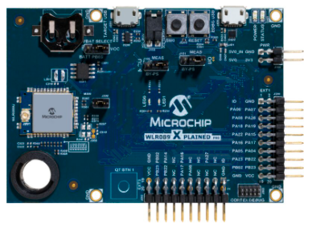

# ATSAMR34_LORAWAN_H3 End device demo
This repo containing a simplified demo from Microchip official LORAWAN stack repo.
https://github.com/MicrochipTech/ATSAMR34_LORAWAN_H3

Target board WLR089 Xplained

1. Download and install [MPLAB® X IDE v6.15 tested](https://www.microchip.com/en-us/development-tools-tools-and-software/mplab-x-ide)
2. Download and install [MPLAB XC32 Compiler v3.01](https://www.microchip.com/en-us/development-tools-tools-and-software/mplab-xc-compilers)
3. Clone this repo
4. Use Batch file to download all H3 packs
   * Default path is ../H3. You can change it from the batch file.
5. Configure the Harmony Framework Path from MPLAB X IDE and select **Tools -> Options -> Plugins**
   * Select **Harmony Path** as `../H3` Step 4. path
   * Validate with **OK**
6. Open the project from MPLAB X IDE

7. Open MCC

8. The LORAWAN Stack component offers two levels of configuration:
   * In Configuration = **Auto** (simple mode), all user configuration will be overriden with default stack values and user has to simply set the Application configuration over the MHC GUI, generate the code and (optionaly) set the Join parameters in `configuration.h` file.

   <p align="center">
   
   </p>

   * In Configuration = **Manual** (advanced mode), the user settings can be configured one bye one such as: Radio configuration, Regional configuration, software timer configuration and sleep configuration. Here, user has also to set the Application configuration according the needs over the MHC GUI, generate the code and (optionaly) set the Join parameters in `configuration.h` file.

   <p align="center">
   
   </p>

9. Generate the code from MPLAB X IDE under **MCC -> Generate Code**

The file `configuration.h` located in `src/config/default` contains the Application settings. The following table showcase the settings generated by MHC and the settings to set manually.

| Settings | Generated by MHC ? |
| -------- | ------------------ |
| Application port number (Fport 1-255) | Yes |
| Periodic timer duration in milliseconds (used for periodic transmission option) | Yes |
| Sub band number | Yes |
| DevEUI read from SAM R34 XPro EDBG ? | Yes |
| DevEUI read from WLR089U0 NVM ? | Yes |
| Activation methods (OTAA or ABP) | Yes |
| Type of transmission (confirmed or unconfirmed message) | Yes |
| Device Class (A or C) | Yes |
| ABP Join Parameters (DevAddr, AppSKey, NwkSKey) | No |
| OTAA Join Parameters (DevEUI, JoinEUI, AppKey) | No |
| Sleep duration in milliseconds | Yes |
| Type of join Nonce (incremental or random) | Yes |
| Certification mode enabled ? | Yes |
| Settings for certification application | No |

The folder `src/config/default/MLS/module_config` contains the user settings in the following files:
- `conf_pmm.h`
- `conf_radio.h`
- `conf_regparams.h`
- `conf_sal.h`
- `conf_stack.h`
- `conf_sw_timer.h`
<br><br>


10. Build and Program the device from MPLAB X IDE under **Production -> Make and Program Device**

11. Observe the output on a console window

```
Last reset cause: External Reset

Microchip LoRaWAN Stack - MLS v2.0.0

Init - Successful


 1. Demo application
 2. Enable/disable Certification mode

Enter your choice:
```

> Note #1: Checkout the [SAM R34 MLS Getting Started Guide](https://www.microchip.com/en-us/product/ATSAMR34J18#document-table) to get details on the application flow.

</br>

> Note #2: If using ATECC608 as crypto companion for the Join process, checkout the following resources to get more details :
> - [Develop with the SAM R34 LoRa SiP and WLR089U0 Module with Microchip LoRaWAN stack on TTI join server](https://github.com/MicrochipTech/atsamr34_ecc608a_tti)
> - [Develop with the SAM R34 LoRa SiP and WLR089U0 Module with Microchip LoRaWAN stack on Actility join server](https://github.com/MicrochipTech/atsamr34_ecc608a_actility)
> - [Secure Authentication with SAMR34 & ATECC608 and The Things Industries’s Join Server](https://github.com/MicrochipTech/secure_lorawan_with_tti)
